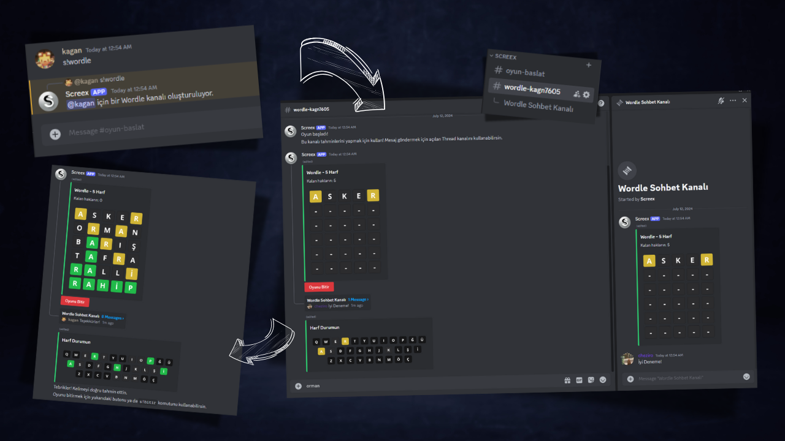

# Screex Bot - Wordle Türkçe Discord Botu
Wordle oyununu Türkçe kelimeler ile oynamaya imkan veren bir Discord botu.
## Wordle Nasıl Oynanır?
- ### Oyunun Kuralları
    - Oyunun başlangıcında Türkçe sözlükten rastgele bir kelime seçilir ve bu kelime oyuncuyla paylaşılmaz.
    - Oyuncunun amacı kendisine tanınan hakları bitirmeden bu kelimeyi doğru tahmin etmektir. (Screex Bot'ta da genelde olduğu gibi hak sayısı 6 tahmin ile sınırlıdır.)
    - Oyuncunun her tahmininde, seçtiği kelimedeki harflere göre farklı renklerle ifade edilen sonuçlar elde edilir:
        - Yeşil renk, harfin yerinin doğru bilindiğini gösterir.
        - Sarı renk, harfin gizli kelimenin içinde olduğunu ancak yerinin yanlış bilindiğini gösterir.
        - Siyah renk, harfin gizli kelimenin içine olmadığını gösterir.
    - Gizli kelimenin "rahip" olduğu bir oyunda "barış" kelimesi kullanılarak yapılan bir tahmin:
        > 
- ### Screex Bot'u Kullanarak Wordle Oynayın
    - Screex Bot'u [davet link'ini](https://discord.com/oauth2/authorize?client_id=750758269827547238&permissions=395405536368&integration_type=0&scope=bot) kullanarak sunucunuza ekleyin.
    - `/ayarla` komutu ile oyun oynayabilmek için gerekli olan oyun kategorisini oluşturun.
    - Oluşturulan `oyun-baslat` kanalında `/wordle [kelime_uzunluğu]` komutunu kullanarak oyunu başlatın.
    - `/peset` komutunu kullanarak pes edin veya `/bitir` komutuyla oyunu bitirin.
    - `/stats` komutunu kullanarak istatistiklerinizi görün.
## Özellikler
- Discord Uygulama Komutları (Slash/Application Commands) desteği
- Türkçe kelimeler ile Wordle oynama şansı
- Her an yeni bir kelime ile yeni bir oyun oynayabilme imkanı
- 5, 6 ve 7 harfli kelime seçenekleri:
    - 5 harfli 5587 kelime
    - 6 harfli 6200 kelime
    - 7 harfli 8133 kelime
- Görsel olarak desteklenen tahmin ve sonuç arayüzü
- Görsel olarak desteklenen harf durumu arayüzü
- Oyuncunun tahminlerini yapabildiği kanala ek olarak diğer oyuncuların da oyun hakkında sohbet edebileceği bir Thread kanalı

## Güncel Türkçe Sözlük
- Oyunda kullanılan kelimeler, [TDK Güncel Türkçe Sözlük'ün](https:/www.sozluk.gov.tr) 12. baskısını referans alan ve [Kemal Ogun Isik](https://github.com/ogun) tarafından hazırlanan [guncel-turkce-sozluk](https://github.com/ogun/guncel-turkce-sozluk) projesinden alınmıştır.
